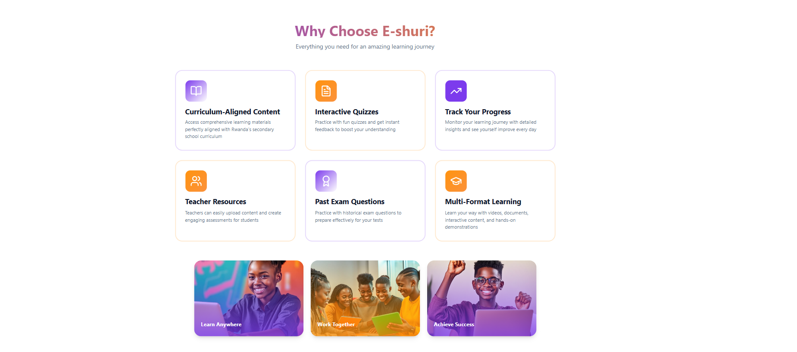
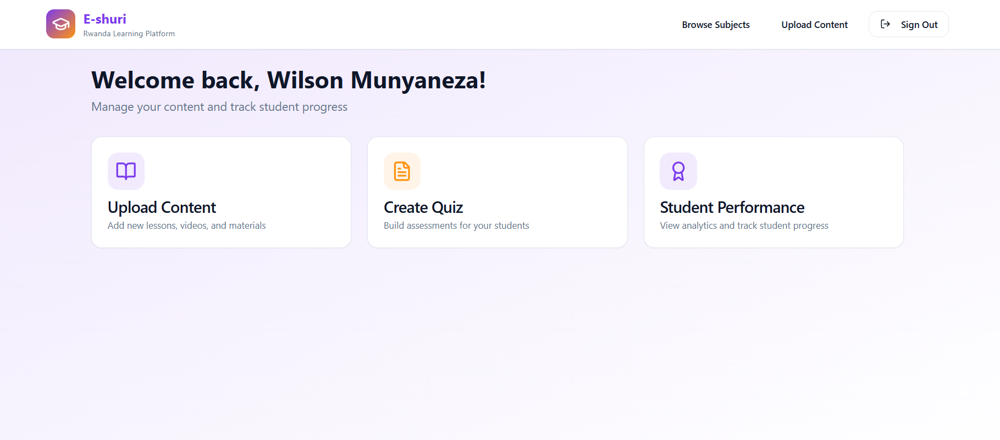
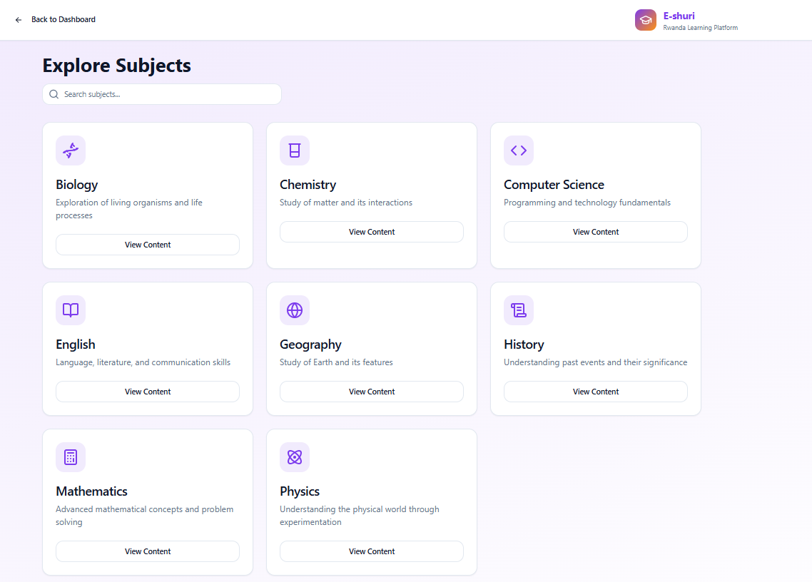
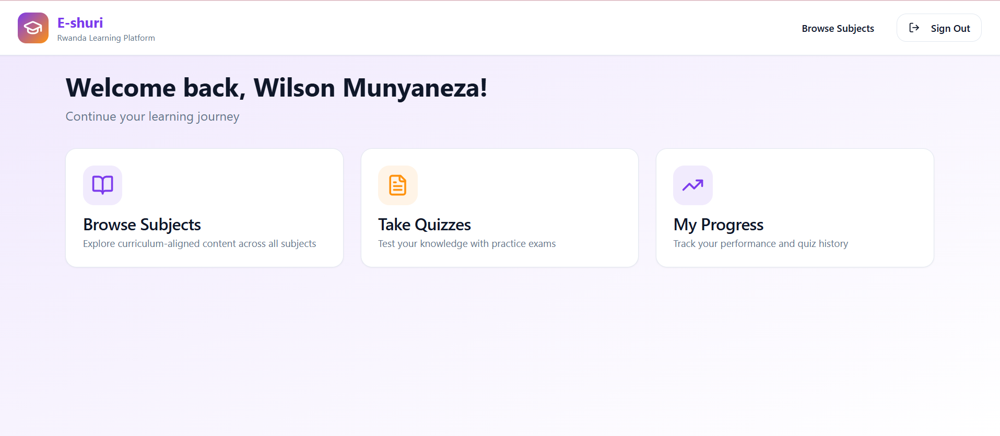

## 📘 E-shuri – Rwanda Digital Learning Platform
E-shuri (Electronic Class) is a web-based learning platform designed to empower students and teachers across Rwanda with curriculum-aligned digital content. The platform provides subjects, quizzes, and progress tracking to enhance learning outcomes, accessibility, and digital literacy.
* 🌍 “Learn, Grow, and Excel with Quality Digital Education.” 

# 🚀 Features
User Authentication – Secure login and account management for students and teachers.

Subject Content Access – Browse subjects (Biology, Chemistry, Computer Science, Mathematics, etc.) with structured materials.

Quizzes & Assessments – Practice tests to evaluate knowledge and skills.

Progress Tracking – Monitor performance and learning history.

Responsive Design – Works seamlessly on desktops, tablets, and mobile devices.

Teacher Tools – Upload and organize educational content.

# 📂 Project Structure
munyaneza-w/
│── public/               # Static assets  
│── src/                  # Source code (React components, pages, logic)  
│── supabase/             # Database configuration and auth  
│── .env                  # Environment variables  
│── index.html            # Entry HTML file  
│── package.json          # Dependencies and scripts  
│── vite.config.ts        # Vite configuration  
│── tailwind.config.ts    # Tailwind CSS config  
│── tsconfig.json         # TypeScript configuration  
│── README.md             # Documentation  

# 🎨 Design
The design process focused on simplicity, usability, and inclusivity.
Wireframes & Mockups: Designed using Figma
Link: https://www.figma.com/design/gMHuPsN8kFgjO33YootGcX/E-shuri?node-id=0-1&m=dev&t=uzBCgYGg36q2rtKQ-1

Styling Framework: Tailwind CSS + custom components.

UI Principles: Minimal, clean, and accessible for students aged 11–18.

# 📸 Screenshots:
## Screenshots

### Home

### Home1

### Sign In Page

### Teachers Dashboard Page

### Subject Page

### Student Dashboard Page

### Teachers Dashboard Page

### Subject Page

### Student Dashboard Page

# ⚙️ Technology Stack
Frontend
React.js + TypeScript

Tailwind CSS (responsive UI)

Vite (fast build tool)

Backend & Database
Node.js + Express.js (API server)

Supabase (Authentication + PostgreSQL Database)

# Development Tools
Visual Studio Code

Git & GitHub

Postman (API testing)

# Deployment
Azure (web hosting and database)

# 🛠️ Setup Instructions
Follow these steps to set up and run the project locally:
* Clone the repository

 git clone https://github.com/munyaneza-w/E-shuri.git
Install dependencies

 npm install
Configure environment variables

# Create a .env file in the root directory

Run the project

 npm run dev

# Access the app
 Open http://localhost:5800/ in your browser.

# ☁️ Deployment Plan
Cloud Hosting: Microsoft Azure

Database Hosting: Supabase PostgreSQL

Continuous Deployment: GitHub → Azure pipeline for automatic builds

* Domain: e-shuri.rw (planned)

# 🎥 Video Demo
📌 Here is the video link: https://drive.google.com/drive/folders/1WoHFKp3-gKm2w65di0vTfsx0kGqWrGJ6?usp=sharing 
# 📖 License
This project is licensed under the MIT License – free to use, modify, and distribute.

